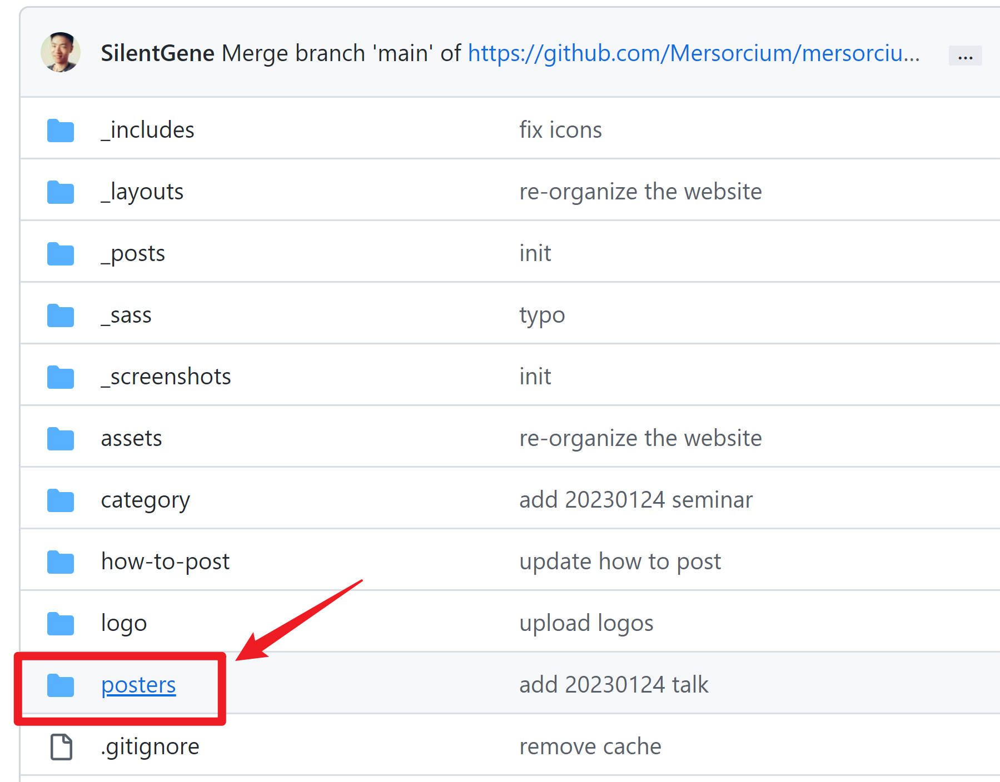
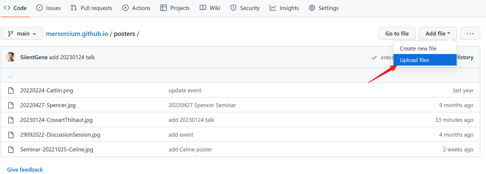
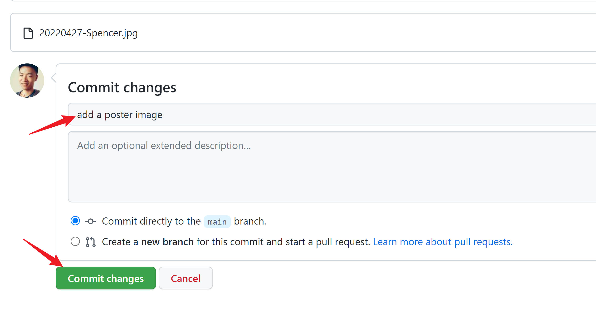
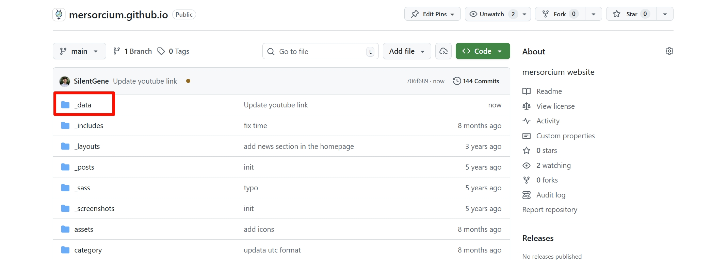
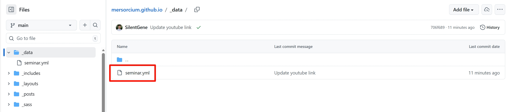
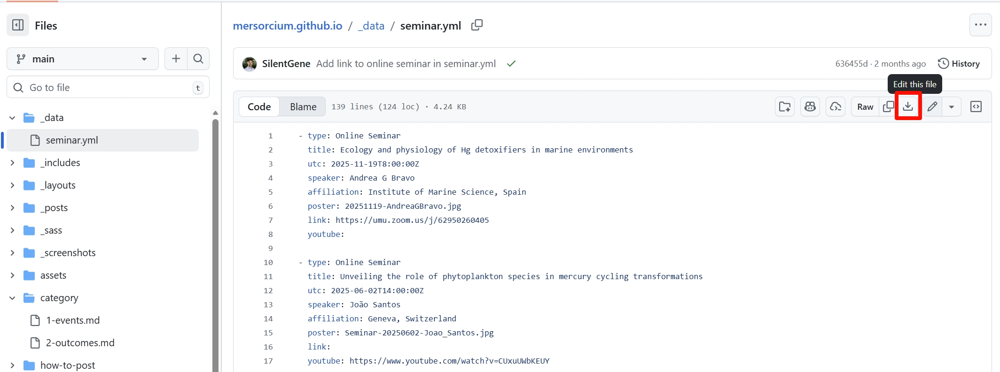
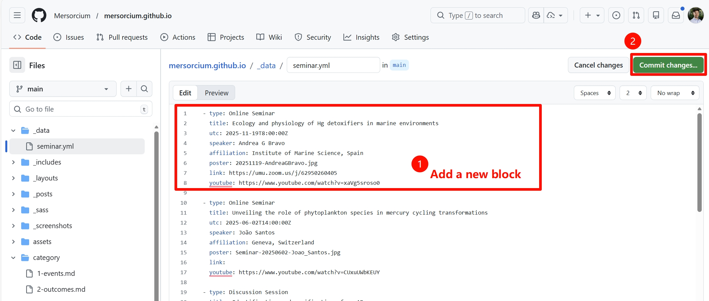

This is the source code of [Mersorcium website](https://mersorcium.github.io/) built by the board member Heyu Lin.

The website is powered by [GitHub Pages](https://pages.github.com/) + [Jekyll](https://jekyllrb.com/), and the theme is customized based on [Hydeout](https://github.com/fongandrew/hydeout).

# How to add new events

You can post a new event in the "Events" side menu by the following 2 steps:

1. Uploading the poster image to the folder [posters](posters)
2. Editing the text content in the file [1-events](category/1-events.md).

Here is how to do them (not so hard!):

## Step 1: Uploading the poster image

Click and enter the folder [posters](posters)

and then upload the image (you need to log in with an authorized account to see this option):

Then confirm the uploading:

## Step 2: Editing the text content

Edit the file: `data_/seminar.yml`

Then edit the content to add a new data block:

**The post should obey the following format:**

Every event is a formatted `block` (circled in red below), so you can copy and paste a previous `block` and then edit the content. Please do not change the item keys listed there; only change the content after the colon. You can leave the content blank if you do not have that information yet.

Then submit the change by click the `commit changes...` button. Don't forget write a title for this change (it can be anything you want).

> Note: GitHub Pages use a small caching window of ~10 min, so you may have to wait a while to see the results.

The website is established and maintained by Heyu (linheyu🌀outlook.com). You can always find solutions from him anytime if you have any problem or feedback:grinning:!

