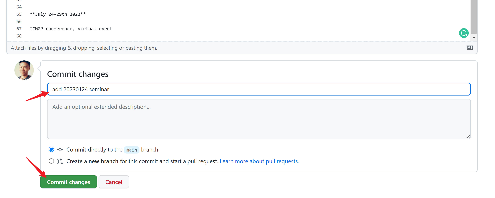

This is the source code of [Mersorcium website](https://mersorcium.github.io/).

The website is powered by [GitHub Pages](https://pages.github.com/) + [Jekyll](https://jekyllrb.com/), and the theme is customized based on [Hydeout](https://github.com/fongandrew/hydeout).

# How to post a new article

You can post a new article by creating a new markdown file in the `_posts` (https://github.com/Mersorcium/mersorcium.github.io/tree/main/_posts) folder.


**The post should obey the following format:**

### Filename format

1. The file name should end with `.md`, which means you can write articles in markdown syntax.
2. The publish date of the post should be specify in the beginning of the filename with the format `yyyy-mm-dd`.
3. A short title could be written after the publish date, but it has nothing to do with the post title, as the post title is specified in the file. 
4. No space is allowed in the filename.
5. An example filename: `2021-09-25-hello-Mersocium.md`

### File content format

Before the main content of the article, a `front matter` should be always attached, where you can specify the `title`, `tags`, and other properties of the articles.

An example front matter:

```
---
title: Hello Mersocium
layout: post
tags:
  - events
  - general
---
```

After the front matter, the main article can begin. The article can be formatted by taking advantage of the markdown syntax. You can find how to use it [here](https://guides.github.com/features/mastering-markdown/) if you don't know it yet.


Finally, click the `Commit new file` button to publish the article!



> Note: GitHub Pages use a small caching window of ~10 min, so you may have to wait a while to see the results.

A few sample posts have been uploaded in the _post folder temporarily, which will be moved to other folders later when the website is officially released.

The website is established and maintained by Heyu (heyu.lin@student.unimelb.edu.au), so you can always find solutions from him anytime if you have any problem or feedback:grinning:!

