---
**Discussion Session**

## Identification and verification of merAB genes

*Speaker*: 

*Time*: 14:00 - 15:00 UTC time, Thursday, February 27th, 2025

---

**Online Seminar**

## Microbial Communities and Methylmercury Dynamics in Prairie Wetland Ponds

*Speaker*: Zohra Zahir (University of Regina)

*Time*: 3pm – 4pm UTC time / 10am – 11am Eastern time (US), Thursday, December 5th, 2024

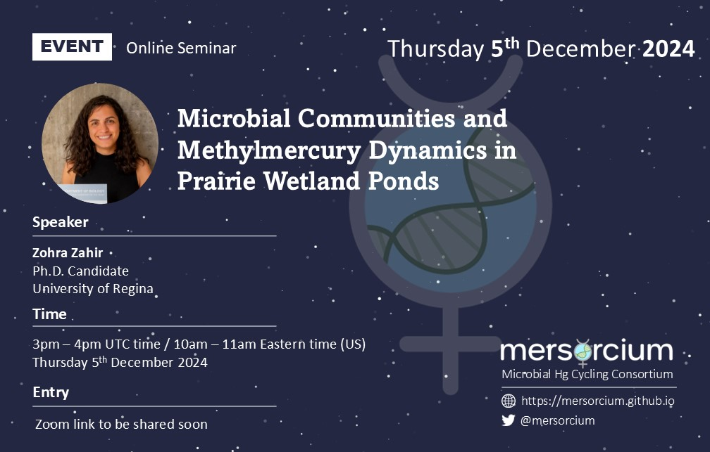

---

**Discussion Session**

## Transcription of *hgcAB*

*Time*: 14:00 - 15:00 UTC time, Thursday, April 4th, 2024

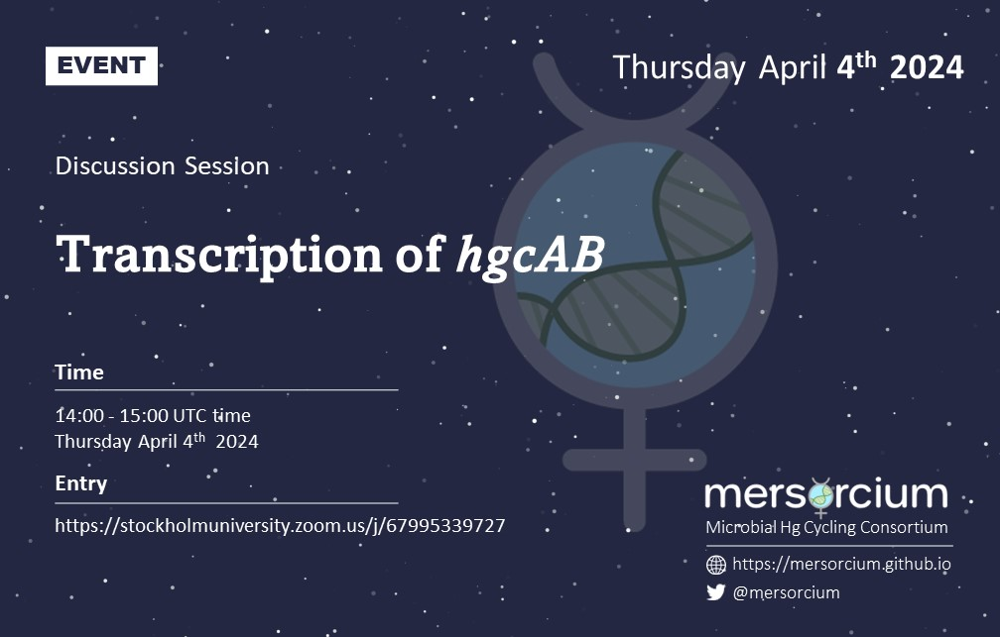

---

**Online Seminar**

## Unmasking the physiology of mercury detoxifying bacteria from polluted sediments

*Speaker*: Carla Pereira-García (Autonomous University of Barcelona and at the Institute of Marine Sciences)

*Time*: 14:00 - 15:00 UTC time, Thursday, February 22nd, 2024

*Seminar Recording*: [Go To Mersorcium YouTube Channel](https://www.youtube.com/watch?v=DtQwP5CdAeY&ab_channel=Mersorcium)

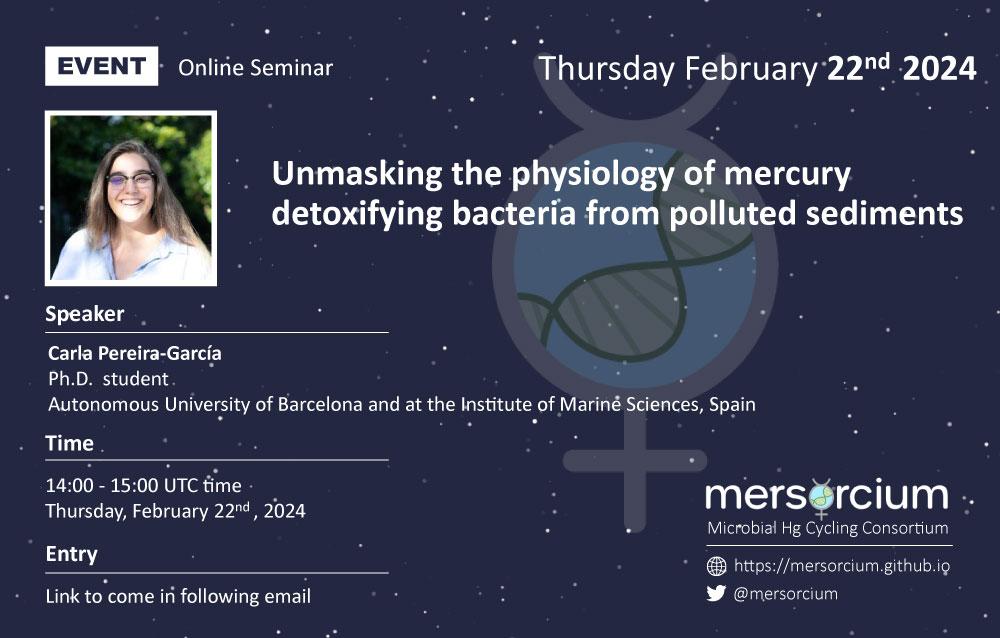

---

**Online Seminar**

## Interaction between mercury and the aquatic plant Elodea nuttallii

*Speaker*: Claudia Cosio (Université Reims Champagne Ardenne)

*Time*: 14:00 - 15:00 UTC time, Friday, June 23rd , 2023

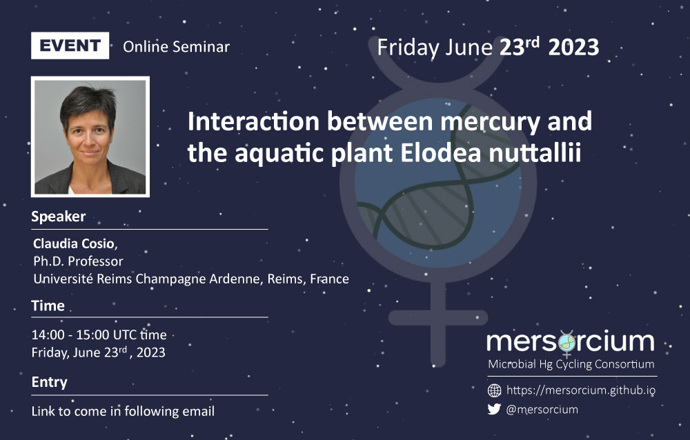

---

**Online Seminar**

## Exploring the Fourth Corner of Mercury Methylation in Prairie Wetland Ponds

*Speaker*: Zohra Zahir (University of Regina)

*Time*: 14:00 - 15:00 UTC time, Thursday, May 18th , 2023

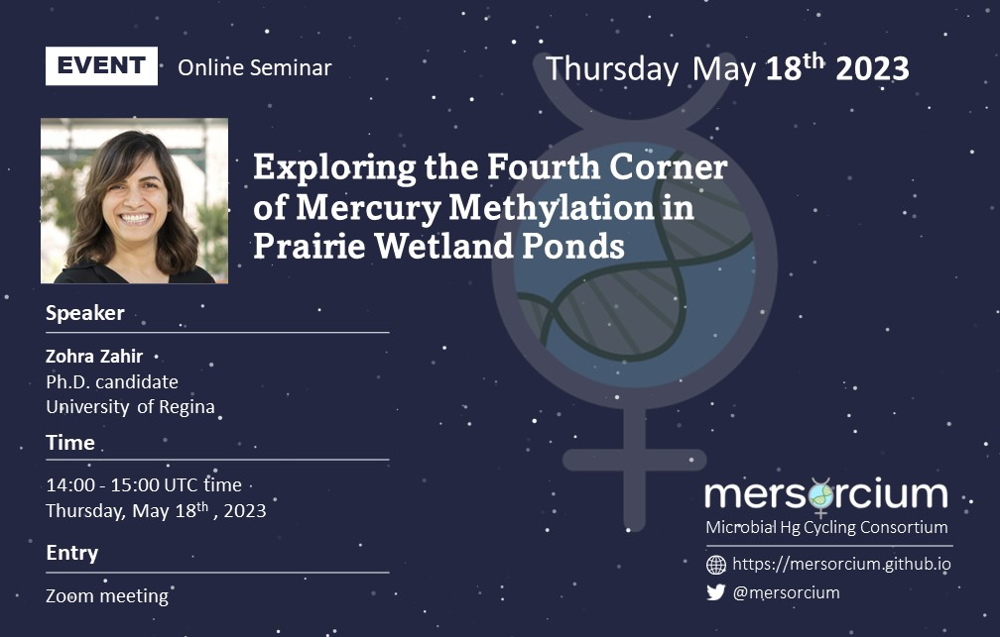

---

**Online Seminar**

## Exploring the role of demethylation of MeHg induced toxicity in vitro and in vivo: using merB as a model

*Speaker*: Ian Krout (Emory University)

*Time*: 14:00 - 15:00 UTC time, Tuesday, April 11th, 2023

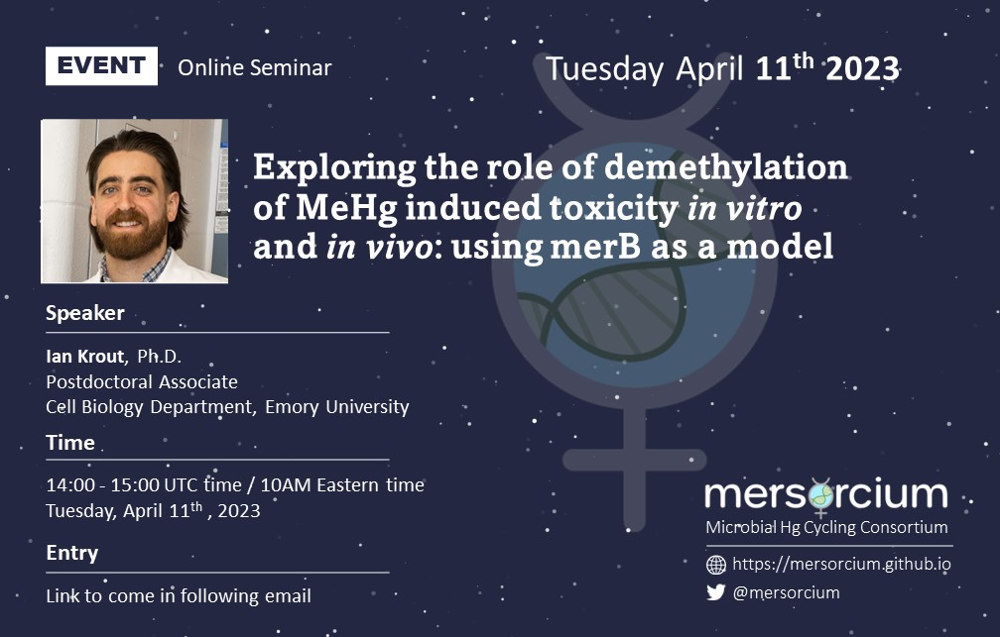

---

**Online Seminar**

## Isotopic tracers as a powerful tool for the determination of microbial Hg species transformations

*Speaker*: Javier García-Calleja (University of Pau)

*Time*: 14:00 - 15:00 UTC time, Thursday, February 23rd, 2023

*Seminar Recording*: [Go To Mersorcium YouTube Channel](https://youtu.be/16cejGujTSA)

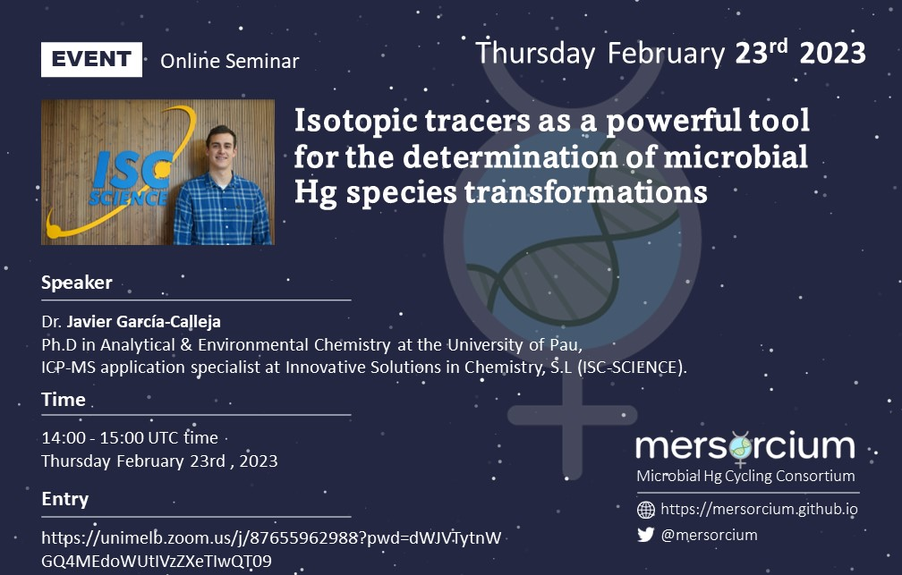

---

**Online Seminar**

## Interactions between Hg compounds and cyanobacteria: from the uptake to biotransformations and effect of thiol-containing ligands

*Speaker*: Cossart Thibaut (Geneva University, Switzerland)

*Time*: 14:00 - 15:00 UTC time, Tuesday, January 24th, 2023

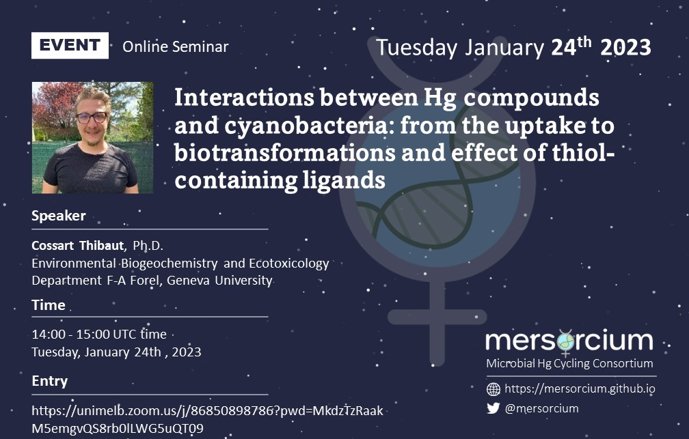

---

**Online Seminar** 

## Microbial mercury cycling from chilean ecosystems - a call for collaboration

*Speaker*: Céline Lavergne (University of Playa Ancha, Chile)

*Time*: 14:00 - 15:00 UTC time, Tuesday, October 25th, 2022

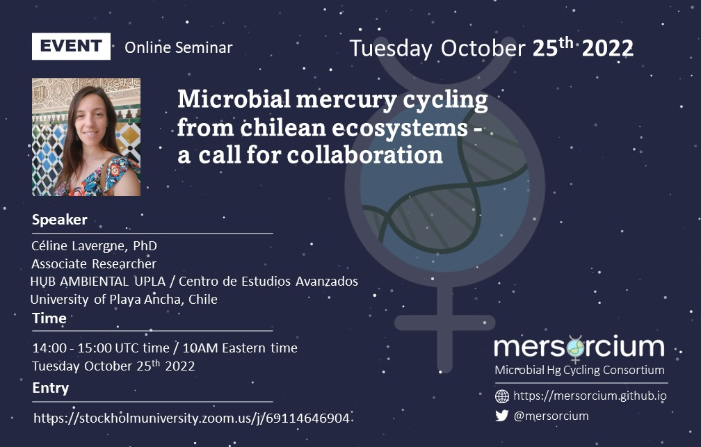

---

**Discussion Session** 

## On microbial transformations of Hg - follow-up to session "Meta-omic and geochemical approaches to linking microbial activity to biogeochemical mercury cycling"

*Time*: 14:00 - 15:00 UTC time, Thursday, September 29th, 2022

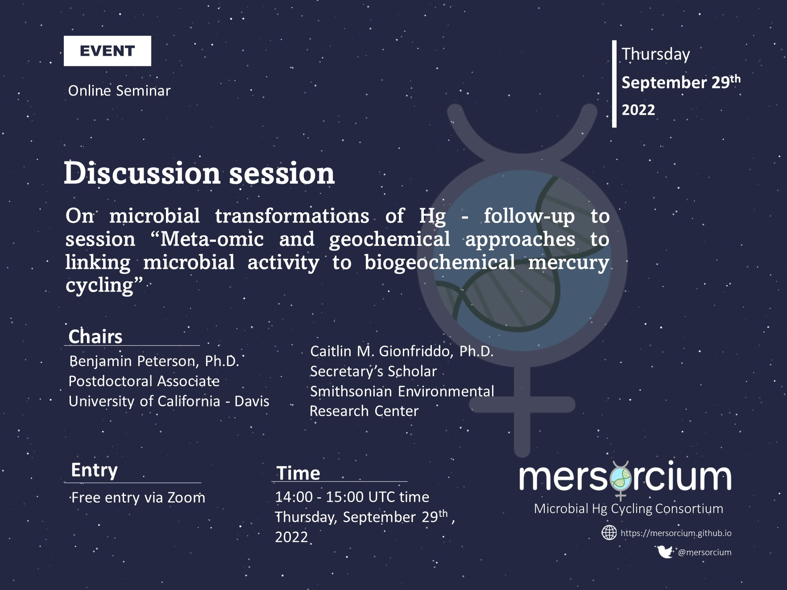

---

**Online Seminar**

## Microbial community dynamics involved in methylmercury production in peatlands

*Speaker*: Spencer Roth (Oak Ridge National Laboratory, US)

*Time*: 14:00 - 15:00 UTC time / 10AM Eastern time, Wednesday, April 27th , 2022

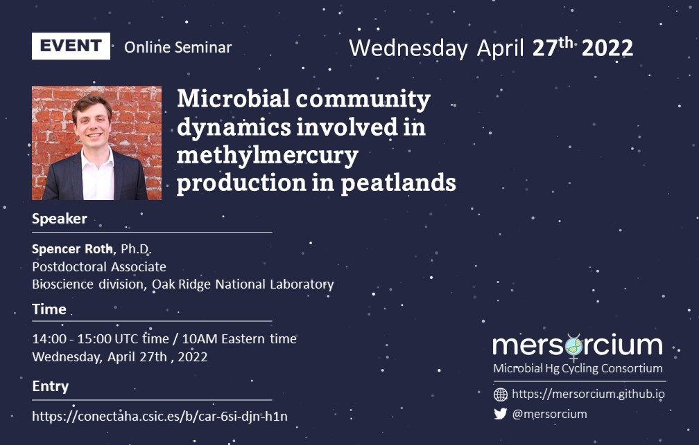

---

**Online Seminar**

## A multi-omics approach to linking microbial community dynamics to mercury biogeochemistry

*Speaker*: Caitlin M. Gionfriddo (Smithsonian Environmental Research Center, US)

*Time*: 15:00 – 16:00 UTC time, Thursday, February 24th, 2022

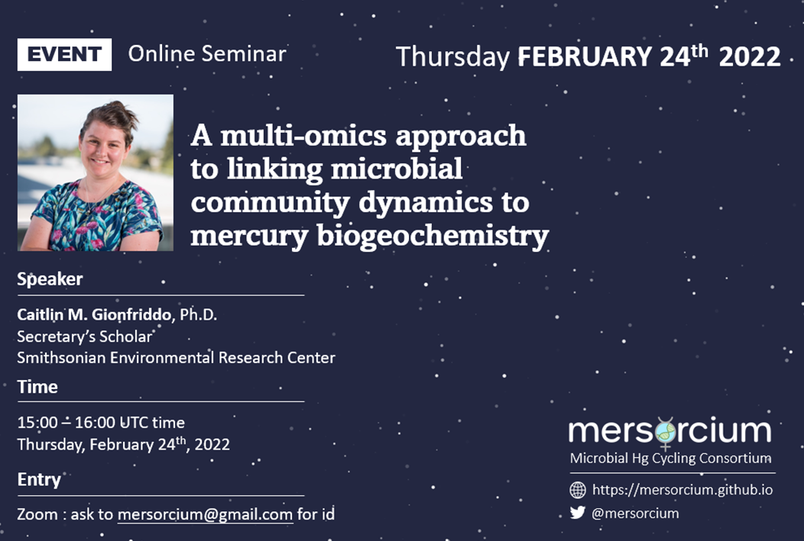

---

**Online Seminar**

## ICMGP conference, virtual event

*Time*: July 24-29th 2022
